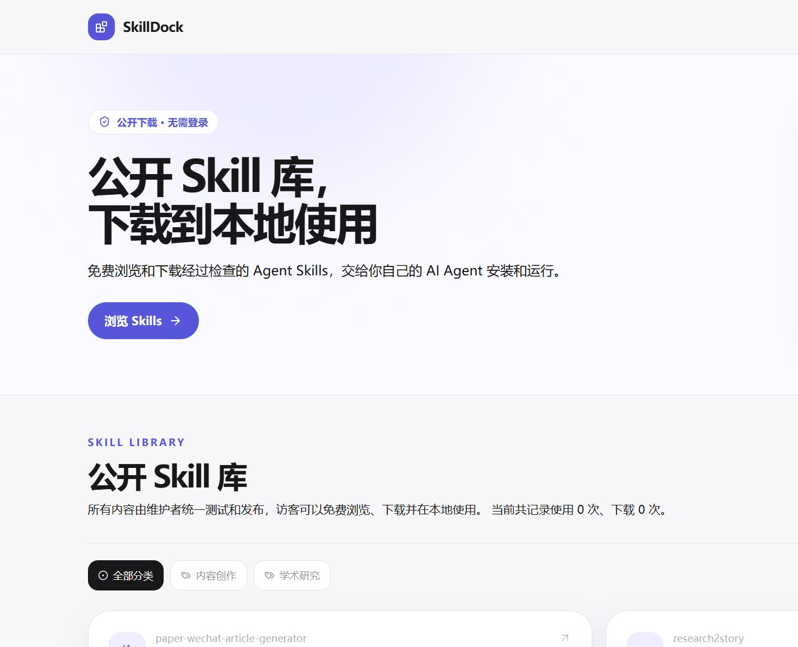

# SkillDock

一个公开的 Agent Skill 库。维护者在 GitHub 仓库中管理、测试和发布 Skill，访客可以浏览、搜索、查看详情并下载 ZIP 包。



## 功能

- 按分类浏览和搜索 Skill
- 查看说明、版本、兼容环境和测试结果
- 下载版本化 Skill ZIP 包
- 通过 Cloudflare Pages 免费托管

## Cloudflare Pages 部署

项目只使用 GitHub → Cloudflare Pages 这一条部署链路，不需要 Docker、云服务器、Workers 或数据库。

在 Cloudflare 控制台选择 `Workers & Pages` → `Create application` → `Pages` → `Connect to Git`，连接 GitHub 仓库 `Star-Learning/SkillDock`，然后配置：

```text
生产分支：main
构建命令：pnpm run build
输出目录：out
根目录：/
```

可选地设置环境变量：

```text
NEXT_PUBLIC_SITE_URL=https://你的项目名.pages.dev
```

连接完成后，推送到 `main` 会自动构建并发布；其他分支和 Pull Request 可以生成预览部署。

## 本地检查

```bash
pnpm install
pnpm run skills:test
pnpm run skills:sync
pnpm run build
```

网站是 Next.js 静态导出项目，构建结果由 Cloudflare Pages 自动从 `out/` 发布。网站不收集页面浏览、点击或下载计数，ZIP 文件直接作为静态资源提供。

Skill 的新增、修改、测试和发布仍由维护者在本地完成，然后提交并推送到 GitHub。
